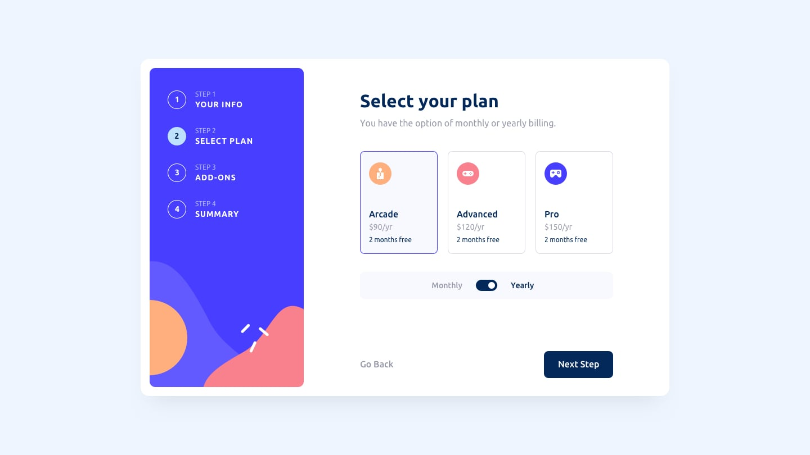
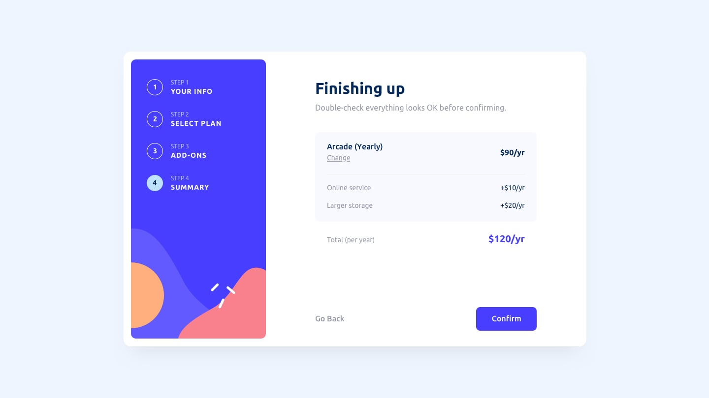
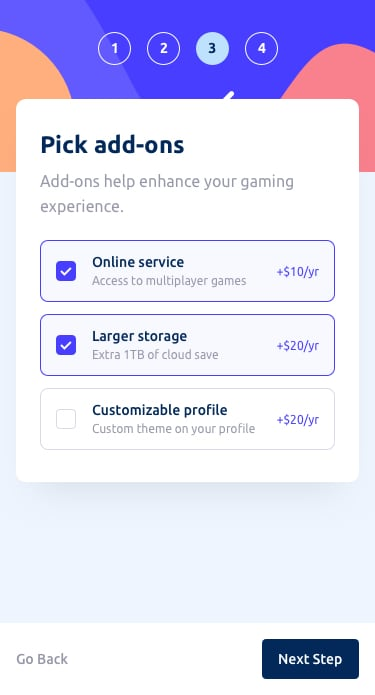

# react-wizard

This project provides a simple onboarding wizard. It is based on the vite starter with the following additions:
* tailwindcss for styling
* react-hook-form for form based actions
* yup for form validation
* shadcn for simple react components that are used to build the form

## Running the App [Start Here]

### Ensure you are running node 20 
```bash
node --version
```
```text
v20.18.0 
```
The app has been tested with node `20.18.0` but it may work with other versions

NOTE: The `.tool-versions` file can be used by `asdf` to ensure the correct node version is used.

### Install all the dependencies
```bash
npm install
```

### Run the application
```bash
npm run dev
```
```text
  VITE v5.4.10  ready in 89 ms

  ➜  Local:   http://localhost:5173/
  ➜  Network: use --host to expose
  ➜  press h + enter to show help
```

The application should start up and be available on http://localhost:5173/

### Other features

#### Linting
```bash
npm run lint
```

#### Testing
TODO: Add testing to project

#### Prototyping
TODO: Add Ladle to the project


## Original Designs (from Frontend Mentor Community)
Frontend Mentor has a number of free coding challenges. This project is based on `Multi-step form`

### Active States


### Desktop Design








#### TODO - Mobile





