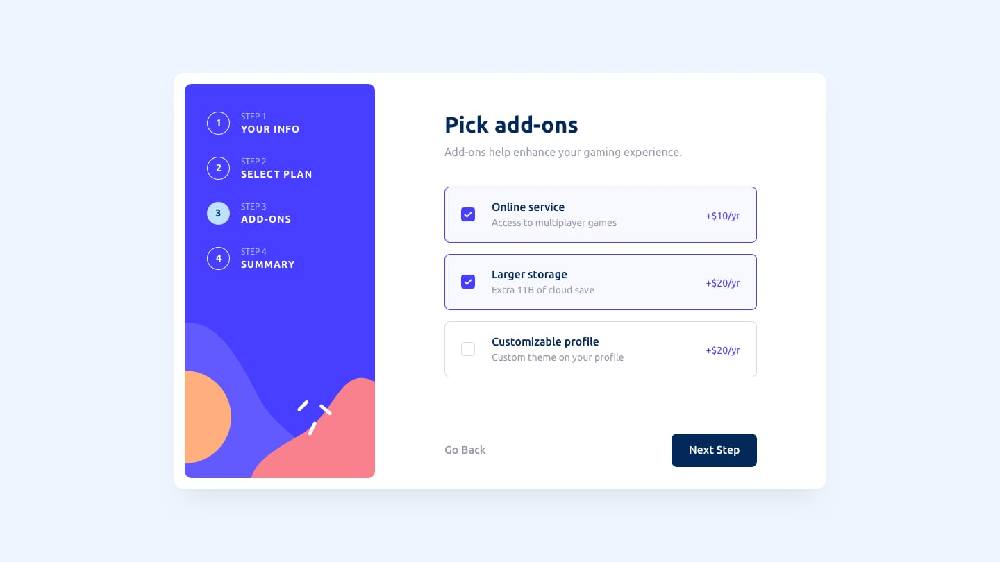

# react-wizard

This project provides a simple onboarding wizard. It is based on the vite starter with the following additions:
* tailwindcss for styling
* react-hook-form for form based actions
* yup for form validation
* shadcn for simple react components that are used to build the form

## Running the App [Start Here]

### Ensure you are running node 20 
```bash
node --version
```
```text
v20.18.0 
```
The app has been tested with node `20.18.0` but it may work with other versions

NOTE: The `.tool-versions` file can be used by `asdf` to ensure the correct node version is used.

### Install all the dependencies
```bash
npm install
```

### Run the application
```bash
npm run dev
```
```text
  VITE v5.4.10  ready in 89 ms

  ➜  Local:   http://localhost:5173/
  ➜  Network: use --host to expose
  ➜  press h + enter to show help
```

The application should start up and be available on http://localhost:5173/

### Other features

#### Linting
```bash
npm run lint
```

#### Testing
TODO: Add testing to project

#### Prototyping
TODO: Add Ladle to the project


## Original Designs (from Frontend Mentor Community)
Frontend Mentor has a number of free coding challenges. This project is based on `Multi-step form`

## Layout

The designs were created to the following widths:

- Mobile: 375px
- Desktop: 1440px

> 💡 These are just the design sizes. Ensure content is responsive and meets WCAG requirements by testing the full range of screen sizes from 320px to large screens.

## Colors

### Primary

- Marine blue: hsl(213, 96%, 18%)
- Purplish blue: hsl(243, 100%, 62%)
- Pastel blue: hsl(228, 100%, 84%)
- Light blue: hsl(206, 94%, 87%)
- Strawberry red: hsl(354, 84%, 57%)

### Neutral

- Cool gray: hsl(231, 11%, 63%)
- Light gray: hsl(229, 24%, 87%)
- Magnolia: hsl(217, 100%, 97%)
- Alabaster: hsl(231, 100%, 99%)
- White: hsl(0, 0%, 100%)

## Typography

### Body Copy

- Font size (paragraph): 16px

### Font

- Family: [Ubuntu](https://fonts.google.com/specimen/Ubuntu)
- Weights: 400, 500, 700

> 💎 [Upgrade to Pro](https://www.frontendmentor.io/pro?ref=style-guide) for design file access to see all design details and get hands-on experience using a professional workflow with tools like Figma.

### Active States


### Desktop Design





#### TODO - Mobile


