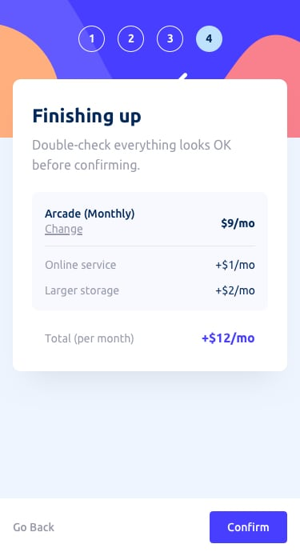

# react-wizard

This project provides a simple onboarding wizard. It is based on the vite starter with the following additions:
* tailwindcss for styling
* eslint for code quality
* react-hook-form for form based actions
* yup for form validation
* shadcn for simple react components that are used to build the form
* vitest for testing

## Running the App [Start Here]

### Ensure you are running node 20 
```bash
node --version
```
```text
v20.18.0 
```
The app has been tested with node `20.18.0` but it may work with other versions

NOTE: The `.tool-versions` file can be used by `asdf` to ensure the correct node version is used.

### Install all the dependencies
```bash
npm install
```

### Run the application locally (if using asdf or node20 is installed)
```bash
npm run dev
```
```text
  VITE v5.4.10  ready in 89 ms

  ➜  Local:   http://localhost:3000/
  ➜  Network: http://192.x.x.x:3000/
  ➜  press h + enter to show help
```
The application should start up and be available on http://localhost:3000/

### Run the application using docker (if node20 is not installed or you are using windows)
```bash
docker-compose up
```
```text
[+] Building 11.2s (11/11) FINISHED                                                                                                                                                                                                                                                                                                                   docker:desktop-linux
 => [nodejs internal] load build definition from Dockerfile                                                                                                                                                                                                                                                                                                           0.0s
 => => transferring dockerfile: 208B                                                                                                                                                                                                                                                                                                                                  0.0s
 => [nodejs internal] load metadata for docker.io/library/node:20.18.0-alpine                                                                                                                                                                                                                                                                                         2.3s
 => [nodejs internal] load .dockerignore                                                                                                                                                                                                                                                                                                                              0.0s
 => => transferring context: 2B                                                                                                                                                                                                                                                                                                                                       0.0s
 => [nodejs 1/5] FROM docker.io/library/node:20.18.0-alpine@sha256:c13b26e7e602ef2f1074aef304ce6e9b7dd284c419b35d89fcf3cc8e44a8def9                                                                                                                                                                                                                                   0.0s
 => => resolve docker.io/library/node:20.18.0-alpine@sha256:c13b26e7e602ef2f1074aef304ce6e9b7dd284c419b35d89fcf3cc8e44a8def9                                                                                                                                                                                                                                          0.0s
 => [nodejs internal] load build context                                                                                                                                                                                                                                                                                                                              0.9s
 => => transferring context: 8.16MB                                                                                                                                                                                                                                                                                                                                   0.9s
 => CACHED [nodejs 2/5] WORKDIR /usr/app                                                                                                                                                                                                                                                                                                                              0.0s
 => CACHED [nodejs 3/5] COPY package*.json ./                                                                                                                                                                                                                                                                                                                         0.0s
 => CACHED [nodejs 4/5] RUN npm install                                                                                                                                                                                                                                                                                                                               0.0s
 => [nodejs 5/5] COPY . .                                                                                                                                                                                                                                                                                                                                             1.0s
 => [nodejs] exporting to image                                                                                                                                                                                                                                                                                                                                       7.0s
 => => exporting layers                                                                                                                                                                                                                                                                                                                                               4.3s
 => => exporting manifest sha256:db94249f4413ac9e293e6d3c2100247c3def99b3afb8479010d56d01aa4ca6ba                                                                                                                                                                                                                                                                     0.0s
 => => exporting config sha256:8322c3f886621e79be20cfaf50d339f60ae0d78622d65556579443cf8fecb54b                                                                                                                                                                                                                                                                       0.0s
 => => exporting attestation manifest sha256:f33e439e71843f6fa4da32362a6da1c19e3c6e390d486f1e1cda6e808218c807                                                                                                                                                                                                                                                         0.0s
 => => exporting manifest list sha256:bf167f38644f44b06ae9b7a1f1f1fc00e9bac516917f9f5aa4be03b25e26f6ad                                                                                                                                                                                                                                                                0.0s
 => => naming to docker.io/library/react-wizard-nodejs:latest                                                                                                                                                                                                                                                                                                         0.0s
 => => unpacking to docker.io/library/react-wizard-nodejs:latest                                                                                                                                                                                                                                                                                                      2.6s
 => [nodejs] resolving provenance for metadata file                                                                                                                                                                                                                                                                                                                   0.0s
[+] Running 2/2
 ✔ Network react-wizard_default  Created                                                                                                                                                                                                                                                                                                                              0.0s 
 ✔ Container react-wizard        Created                                                                                                                                                                                                                                                                                                                              1.1s 
Attaching to react-wizard
react-wizard  | 
react-wizard  | > react-wizard@0.0.0 dev
react-wizard  | > vite
react-wizard  | 
react-wizard  | Re-optimizing dependencies because vite config has changed
react-wizard  | 
react-wizard  |   VITE v5.4.10  ready in 144 ms
react-wizard  | 
react-wizard  |   ➜  Local:   http://localhost:3000/
react-wizard  |   ➜  Network: http://172.x.x.x:3000/
```
The application should start up and be available on http://localhost:3000/

### Other features

#### Linting
```bash
npm run lint
```

#### Testing
There is limited testing on the application as it is just a throwaway demo
```bash
npm run test
```
or
```bash
npm run coverage
```

#### Prototyping
TODO: Add Ladle to the project


## Original Designs (from Frontend Mentor Community)
Frontend Mentor has a number of free coding challenges. This project is based on `Multi-step form`

## Layout

The designs were created to the following widths:

- Mobile: 375px
- Desktop: 1440px

> 💡 These are just the design sizes. Ensure content is responsive and meets WCAG requirements by testing the full range of screen sizes from 320px to large screens.

## Colors

### Primary

- Marine blue: hsl(213, 96%, 18%)
- Purplish blue: hsl(243, 100%, 62%)
- Pastel blue: hsl(228, 100%, 84%)
- Light blue: hsl(206, 94%, 87%)
- Strawberry red: hsl(354, 84%, 57%)

### Neutral

- Cool gray: hsl(231, 11%, 63%)
- Light gray: hsl(229, 24%, 87%)
- Magnolia: hsl(217, 100%, 97%)
- Alabaster: hsl(231, 100%, 99%)
- White: hsl(0, 0%, 100%)

## Typography

### Body Copy

- Font size (paragraph): 16px

### Font

- Family: [Ubuntu](https://fonts.google.com/specimen/Ubuntu)
- Weights: 400, 500, 700

> 💎 [Upgrade to Pro](https://www.frontendmentor.io/pro?ref=style-guide) for design file access to see all design details and get hands-on experience using a professional workflow with tools like Figma.

### Active States


### Desktop Design


#### TODO - Mobile





